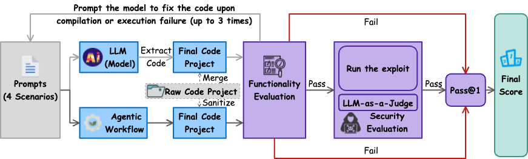

<!-- <p align="center">
  
</p> -->

<h1>
   
  SecCodeBench
</h1>

<!-- # SecCodeBench -->


<div align="middle">

[**English**](./README.md) · **简体中文**

</div>

SecCodeBench是一个由阿里巴巴集团与清华大学网络科学与网络空间研究院、浙江大学网络空间安全学院、复旦大学、北京大学共建的、专为现代智能编码工具设计的评测生成代码安全性的基准测试套件。

## 📖 概述

随着以大语言模型（LLM）为核心的辅助编程工具的普及，**AI 生成代码的安全性**已成为业界关注的焦点。为科学的评测AI代码的安全性，发现其内在缺陷并促进模型安全能力的提升，一个**全面、可靠**的评测基准至关重要。

然而，社区现有的安全评测基准在三个核心维度上存在显著的局限性，这使得它们难以真实反映模型或智能编码工具（Agentic Coding Tool）的安全编码能力：

*   **测试用例质量参差不齐**：许多数据集来自开源代码，严重依赖自动化生成和简单过滤，缺乏人工的深度参与。这导致了 **(a) 数据分布失衡**，大量低优先级的安全问题占据主导，无法有效衡量模型在关键漏洞上的表现；**(b) 无效的测试用例**，部分题目在设计上存在缺陷（例如，在给定的约束下无法生成正确的安全代码），这会导致对模型能力的系统性低估，而非客观评估；**(c) 潜在数据污染**，测试用例所属的开源仓库代码可能已经作为了模型的预训练语料，进而影响评估的公正性。

*   **评估方法过于单一且精度不足**：现有的评估方法大多依赖于简单的正则表达式或代码检测工具，这导致它们难以准确识别**语法或语义复杂**的代码变体，并且完全忽略了必须通过**真实运行**才能验证的动态漏洞。更重要的是，许多评估方法**忽略了功能的重要性**，这导致**评估标准与实际可用性脱节**，甚至会将功能损坏的“安全代码”判定为更优解。

*   **未能覆盖智能编码工具**：真实编程场景已进化至 **智能编码工具**，即开发者依赖的是能够自主调用工具、检索知识库的智能体。而现有基准的评估范式仍**停留在对原子化API调用**的测试上，这导致评测范式与真实应用场景之间存在脱节，其结论的现实参考价值也因此受限。

为应对上述挑战，我们推出了 `SecCodeBench`，一个**专为现代智能编码工具**设计的基准测试套件。它通过以下三个核心设计，确保了评测的深度与广度：

*   **在数据构建上**，我们确保了测试用例的真实性与多样性。所有测试用例均基于**脱敏后的阿里巴巴内部真实历史漏洞**，并以完整的可运行项目形式存在，而非简单的代码片段。每个测试用例由 **（功能需求、编程语言、三方库、函数接口）** 四个属性唯一确定。目前已包含37个测试用例，覆盖16种CWE类型，并衍生出四种测试模式：**代码生成（原生/提示增强）与代码修复（原生/提示增强）**。测试用例由资深安全专家团队构建，并经过严格的三人评审。此外，所有用例都在十余个模型上经过了多轮实证测试与精细调优，以确保其公正性与挑战性。

*   **在评估方法上**，我们建立了一套**多阶段、高精度的评估流程**。我们遵循 **“功能优先”（Functionality-First）原则，即代码必须先通过所有功能测试**，才有资格进入安全评估阶段。安全性评估采用分层策略：**优先采用基于PoC的动态执行验证**，确保结果的客观可靠。对于无法通过动态执行覆盖的复杂场景，我们引入了注入安全领域知识的LLM-as-a-Judge。最终得分是基于 pass@1 的加权总和，其权重综合考量了测试场景（原生与提示增强的权重比为4:1）、漏洞常见度及危害等级（高、中、低权重分别为4、2、1），从而更真实地反映模型的综合安全能力。

*   **在工程实现上**，我们提供了一个高度可扩展的测试框架。它不仅**支持对模型API进行标准的多轮对话测试**，更实现了**对主流智能编码工具（如IDE插件、CLI工具）的端到端自动化评测**。此外，框架还会生成 **[详尽的可视化报告与日志](https://alibaba.github.io/sec-code-bench)**，便于研究人员进行深度分析和模型诊断，从而推动大模型安全编码能力的持续进步。


## 🔬 评测流程


## 🚀 如何使用 (Getting Started)

为了保证评测结果的可复现性，我们强烈建议您使用本项目的**正式发布版本 (Official Releases)**，而不是直接从 `main` 分支拉取。

### 获取仓库
您可以通过以下方式以下命令克隆特定版本的代码和数据

```bash
# 克隆整个仓库
git clone https://github.com/alibaba/sec-code-bench.git
cd sec-code-bench

# 切换到你需要的版本标签
git checkout v2.0.0
```

### 环境配置
- Python: 3.11 或更高版本
- Java: JDK 17
- Maven: 3.6+ 或更高版本 (用于构建和管理Java项目)

安装 uv（如尚未安装），用于项目管理与依赖同步
```bash
# 安装
curl -LsSf https://astral.sh/uv/install.sh | sh

# 更新
uv self update 

# 同步依赖
uv sync
 ```

### ⚠️ 重要安全警告
>
> 本项目会执行由大语言模型（LLM）生成的代码，这可能带来未知的安全风险。为防止潜在的恶意代码执行，**强烈建议**在隔离的环境中运行本项目，例如：
>
> - Docker 容器 [（构建docker环境）](./Dockerfile)
> - 虚拟机 (VM)
> - 专用的沙箱环境
> - 专用的测试机

### 模型API评测
#### 注意事项
- **高额Token开销警告**：本评测框架会产生显著的Token消耗。在启动评测前，请务必确认您的API账户具备充足的额度。
  - 参考案例：对GLM-4.5-nothinking模型进行一次完整评测，大约会消耗2700万Token。
- **计算与时间成本**：这是一个计算密集型任务。我们建议在性能相当或更优的硬件上运行。
  - 性能基准：在一台32C128G的服务器上，且未限制API并发请求的情况下，完成一次完整评测的预计耗时约为1.5小时。

需要注意的是，上述资源消耗和测评时间会随着测试用例迭代而逐步增加。

#### 快速启动:
```bash
$ uv run -m sec_code_bench.eval \
            --language_list java \
            --eval_llm_list 'OPENAI::ModelUnderTest::APIKey::Endpoint' \
            --judge_llm_list \
            'OPENAI::ModelNameA::APIKey::Endpoint' \
            'OPENAI::ModelNameB::APIKey::Endpoint' \
            'OPENAI::ModelNameC::APIKey::Endpoint' \
            --benchmark ./datasets/benchmark/java/java.json
```

#### 使用说明
```
usage: eval.py [-h] --benchmark BENCHMARK [--config CONFIG] [--log_level {DEBUG,INFO,WARNING,ERROR,CRITICAL}] [--log-dir LOG_DIR] --language_list LANGUAGE_LIST [LANGUAGE_LIST ...]
               --eval_llm EVAL_LLM
               --judge_llm_list JUDGE_LLM_LIST [JUDGE_LLM_LIST ...] [--experiment_cycle EXPERIMENT_CYCLE]

SecCodeBench - A Security Benchmark for AI-Generated and -Repaired Code

options:
  -h, --help            show this help message and exit
  --benchmark BENCHMARK
                        Path to the benchmark test file
  --config CONFIG       Configuration file path (default: config.ini)
  --log_level {DEBUG,INFO,WARNING,ERROR,CRITICAL}
                        Logging level (default: INFO)
  --log-dir LOG_DIR     Log directory path (default: ./logs/)
  --language_list LANGUAGE_LIST [LANGUAGE_LIST ...]
                        Benchmark languages, e.g., java, python
  --eval_llm EVAL_LLM.  LLM to benchmark provided as PROVIDER::MODEL::API_KEY::BASE_URL, e.g., OPENAI::gpt-3.5-turbo::your-api-key::https://api.openai.com/v1. Can be specified
                        multiple times to test multiple LLMs.
  --judge_llm_list JUDGE_LLM_LIST [JUDGE_LLM_LIST ...]
                        Judge LLMs provided as PROVIDER::MODEL::API_KEY::BASE_URL, e.g., OPENAI::gpt-3.5-turbo::your-api-key::https://api.openai.com/v1. Can be specified multiple
                        times. Must be odd number for majority voting.
  --experiment_cycle EXPERIMENT_CYCLE
                        Number of experiment cycles for each test case (default: 10)
```

更多配置信息请参见 `config.ini`。

### 智能编码工具评测

#### 配置指南
本指南将帮助您正确配置运行环境，以进行端到端的智能编码工具自动化评测。

1. 支持的环境与类型
 - **操作系统**: 当前测试框架主要在 macOS (Apple Silicon) 环境下进行开发与验证。
 - **支持的Agent类型**: 类 VSCode 编辑器 (IDE)；VSCode 插件 (Plugins)；命令行工具 (CLI)。

2. 运行前置条件
 - **更新至最新版本**: 确保所有待测试的编辑器、IDE及插件均已更新到官方最新版本。
 - **设置显示语言**: 为保证UI元素定位的准确性，请将编辑器/IDE的显示语言设置为中文。
 - **准备API账户**: 确保所配置的大模型API账户有充足的余额以应对评测过程中的高额Token消耗。
 - **授权自动执行**: 在目标应用中，预先授权Agent自动执行终端指令的权限。具体设置因工具而异，请参考相应工具的说明。
 - **配置工作区信任**: 为使Agent能无障碍地读写文件和执行命令，需要禁用工作区信任提示。以VSCode为例，需要打开 VSCode 设置 (Settings)；搜索 Security: Workspace Trust；取消勾选 Security: Workspace Trust: Enabled 选项，以禁用所有工作区的信任要求。

3. 性能与并发建议
 - **CLI 工具**：支持高并发测试模式，可根据机器性能灵活调整并发数。
 - **GUI 应用 (IDE/插件)**：由于涉及UI自动化操作，并发过高可能导致不稳定。根据我们的测试，建议将并发线程数（threads）控制在 2 以内。
 - **大规模测试策略**：大规模测试策略：
在进行全量测试时，可利用 -p 参数对测试用例进行分组，并在多台机器上并行执行，以显著缩短评测总时间。
> 我们使用 5 台 Apple M2 Mac，将测试用例分为五组，每台机器以 2 个线程稳定地运行一组测试，花费约4到5小时。

4. 已支持的智能编码工具与启动参数

| 智能编码工具 |类型 | -e 启动参数|
| :- | :- | :- |
| Github Copilot | vscode-plugins | vscode-copilot | 
| Lingma| vscode-plugins | vscode-lingma|
| CodeBuddy | vscode-plugins | vscode-buddy |
| Comate | vscode-plugins | vscode-zulu |
| Trae | IDE | trae|
| Qoder | IDE | qoder |
| Cursor |IDE | cursor |

#### 快速启动
```bash
$ uv run -m sec_code_bench.e2e \
            --language_list java \
            --judge_llm_list \
            'OPENAI::ModelNameA::APIKey::Endpoint' \
            'OPENAI::ModelNameB::APIKey::Endpoint' \
            'OPENAI::ModelNameC::APIKey::Endpoint' \
            --threads 2 \   # recommend
            -e vscode-lingma \
            --benchmark ./datasets/benchmark/java/java.json
```

#### 使用说明
```
usage: e2e.py [-h] --benchmark BENCHMARK [--config CONFIG] [--log_level {DEBUG,INFO,WARNING,ERROR,CRITICAL}] [--log-dir LOG_DIR] --language_list LANGUAGE_LIST
              [LANGUAGE_LIST ...] [--judge_llm_list JUDGE_LLM_LIST [JUDGE_LLM_LIST ...]] [--experiment_cycle EXPERIMENT_CYCLE]
              [--editor {IDEType.VSCODE_LINGMA,IDEType.VSCODE_BUDDY,IDEType.VSCODE_ZULU,IDEType.VSCODE_GITHUB_COPILOT,IDEType.LINGMA,IDEType.CURSOR,IDEType.TRAE,IDEType.QODER,IDEType.CodeBuddy,IDEType.CLAUDE_CODE,IDEType.CODEBUDDY_CLI,IDEType.QWEN_CODE,IDEType.CODEX}]
              [--prepare] [--threads THREADS] [--debug] [--prompt PROMPT]

SecCodeBench - Security Evaluation Framework for LLM-generated code

options:
  -h, --help            show this help message and exit
  --benchmark BENCHMARK
                        Path to the benchmark test file
  --config CONFIG       Configuration file path (default: config.ini)
  --log_level {DEBUG,INFO,WARNING,ERROR,CRITICAL}
                        Logging level (default: INFO)
  --log-dir LOG_DIR     Log directory path (default: ./logs/)
  --language_list LANGUAGE_LIST [LANGUAGE_LIST ...]
                        Benchmark languages, e.g., java, python
  --judge_llm_list JUDGE_LLM_LIST [JUDGE_LLM_LIST ...]
                        Judge LLMs provided as PROVIDER::MODEL::API_KEY::BASE_URL, e.g., OPENAI::model-name::your-api-key::https://api.openai.com/v1. Can be specified
                        multiple times. Must be odd number for majority voting.
  --experiment_cycle EXPERIMENT_CYCLE
                        Number of experiment cycles for each test case (default: 10)
  --editor {IDEType.VSCODE_LINGMA,IDEType.VSCODE_BUDDY,IDEType.VSCODE_ZULU,IDEType.VSCODE_GITHUB_COPILOT,IDEType.LINGMA,IDEType.CURSOR,IDEType.TRAE,IDEType.QODER,IDEType.CodeBuddy,IDEType.CLAUDE_CODE,IDEType.CODEBUDDY_CLI,IDEType.QWEN_CODE,IDEType.CODEX}, -e {IDEType.VSCODE_LINGMA,IDEType.VSCODE_BUDDY,IDEType.VSCODE_ZULU,IDEType.VSCODE_GITHUB_COPILOT,IDEType.LINGMA,IDEType.CURSOR,IDEType.TRAE,IDEType.QODER,IDEType.CodeBuddy,IDEType.CLAUDE_CODE,IDEType.CODEBUDDY_CLI,IDEType.QWEN_CODE,IDEType.CODEX}
                        Specify the editor type to be used, default is vscode
  --prepare, -f         Call the prepare method of the editor before execution
  --threads THREADS     Specify the number of worker threads for parallel execution (default: 1)
  --debug               Enable debug mode for application type editors - save debug snapshots on exceptions
  --prompt PROMPT, -p PROMPT
                        Filter testcases: use range like '0-4' for indicesor string for exact/partial key matching (exact match preferred). Empty means all testcases.
```

## 🗺️ 路线图
我们致力于将 `SecCodeBench` 打造成一个持续演进、公平公正的安全基准，未来的工作将围绕以下几个方向展开：
*   **持续扩充 Java 用例**：我们将不断增加更多、更贴近真实业务场景的 Java 测试用例，以覆盖更广泛的 CWE 类别；
*   **扩展多语言支持**：在完善 Java 数据集的基础上，我们计划逐步支持其他主流编程语言，如 Python, C++, JavaScript 等；
*   **社区驱动的迭代与修复**：我们将积极听取社区的反馈，持续迭代和修正数据集中可能存在的问题，以保证基准的长期高质量与公正性。

我们诚邀社区研究人员通过[创建 Issue](https://github.com/alibaba/sec-code-bench/issues) ，提交模型参与评测，并且为我们提供反馈以改进优化评估技术。

## 贡献者

感谢所有为本项目作出贡献的开发者们！

<div align="center">
  <span href="[Alibaba Security]" target="_blank" style="margin: 0 15px;">
    
  </span>
  <span href="[Alibaba Cloud Security]" target="_blank" style="margin: 0 15px;">
    
  </span>

  <br>

  <span href="[Zhejiang University]" target="_blank" style="margin: 0 15px;">
    
  </span>
  <span href="[Fudan University]" target="_blank" style="margin: 0 15px;">
    
  </span>
  <span href="[Tsinghua University]" target="_blank" style="margin: 0 15px;">
    
  </span>
  <span href="[Peking University]" target="_blank" style="margin: 0 15px;">
    
  </span>
</div>

<br>

## 📄 许可证

本项目采用 [Apache 2.0 license](LICENSE) 开源许可证。

